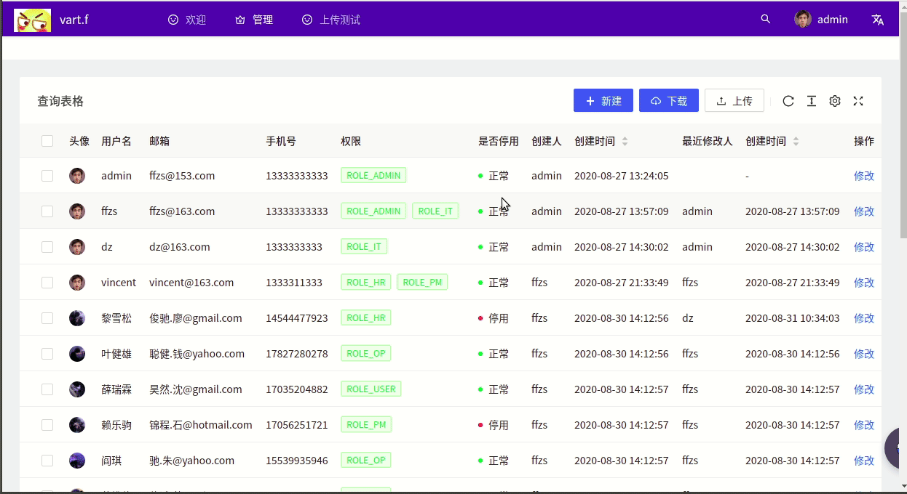

# Spring WebFlux + React搭建后台管理系统（7）: 实现excel文件上传下载


后台管理系统的excel导出功能，以及使用excel进行批量导入都是必不可少的功能，本篇主要介绍内容如下：

+ java后端 excel的读写
+ excel类型判断以及通过反射适配class
+ 后端接收upload服务逻辑实现
+ 后端download服务逻辑
+ 前端upload组建使用
+ 前端download配置

先上效果图：



## 1. 读取Excel文件

### 1.1 添加依赖

通过使用poi进行excel文件的解析：

```java
implementation 'org.apache.poi:poi:4.0.1'
implementation 'org.apache.poi:poi-ooxml:4.0.1'
```

版本不要太高容易报错，spring使用的基础包版本可能不支持

### 1.2  生成workbook

+ workbook是excel的基本类，输入一个inputStream，作为数据源
+ 用过workbook生成一个sheet
+ 通过sheet生成row，用过row生成cell
+ 读取就是获取cell中的数据，写入就是将数据写入cell，设置cell的Style等
+ 由于xls和xlsx版本不同，xls只是xml写的文件，而xlsx是一个压缩包，解析模板不同，需要通过不同的解析系统生成workbook

```java
    private static final String XLS = "xls";
    private static final String XLSX = "xlsx";

    public static Workbook getWorkbook(InputStream inputStream, String fileType) throws IOException {
        Workbook workbook = null;
        if (fileType.equalsIgnoreCase(XLS)) {
            workbook = new HSSFWorkbook(inputStream);
        } else if (fileType.equalsIgnoreCase(XLSX)) {
            workbook = new XSSFWorkbook(inputStream);
        }
        return workbook;
    }
```

+ 生成sheet

```java
Sheet sheet = workbook.getSheetAt(sheetId);
```

### 1.3 获取类数据

+ 为了方便使用反射，这里默认表格第一行为属性名
+ 根据表格中顺序获取属性名

```java
Row header = sheet.getRow(0);
if (header == null) {
    log.warn("解析失败表头没有数据");
    return null;
}
int columnNum = header.getPhysicalNumberOfCells();
String[] properties = new String[columnNum];
for (int i = 0; i < properties.length; i++) {
    properties[i] = header.getCell(i).toString();
}
```

+ 因为要转化为对象，这里获取类的所有set方法
+ 获取所有属性对应的类型

```java
Map<String, Method> methods = Stream.of(clazz.getMethods())
        .filter(method -> method.getName().startsWith("set"))
        .collect(Collectors.toMap(Method::getName, it->it));

Map<String, Type> fieldMap = Stream.of(clazz.getDeclaredFields())
        .collect(Collectors.toMap(Field::getName, Field::getType));
```

### 1.4 获取数据

+ 通过循环行获取row
+ row循环列获取cell
+ 通过cell获取数据
+ 通过反射将以及对应set方法，将数据写入对象

```java
var objs = new ArrayList<>();
for (int i = startRowNum; i <= endRowNum; ++i) {
    Row row = sheet.getRow(i);

    if (row == null) continue;

    Object obj = clazz.getDeclaredConstructor().newInstance();
    try {
        for (int j = 0; j < columnNum; j++) {
            var methodName = "set" + properties[j].substring(0, 1).toUpperCase() + properties[j].substring(1);
            if (methods.containsKey(methodName)){
                Method method = methods.get(methodName);
                Cell cell = row.getCell(j);
                Type type = fieldMap.get(properties[j]);
                method.invoke(obj,cell2Obj(cell, type));
            }
        }
    } catch (Exception e) {
        log.error("{}文件的第{}行解析出现错误，错误类型为{}，错误内容{}", fileName, i, e.getClass(), e.getMessage());
    }
    objs.add(obj);
}
```

### 1.5 数据类型转化

由于excel使用的原因，通过泛型处理会出现类型对不上的情况，比如一个数值，excel默认所有数值都是`double`类型，如果你的对象中是Long的话，那么就要进行处理不然没法`cast`

+ 时间的处理比较烦，这里默认时间都是字符串类型
+ 还有list类型也要特别处理

```java
private static Object cell2Obj(Cell cell, Type type) {
    if (cell == null) return null;
    Object value = null;
    switch (cell.getCellType()) {
        case NUMERIC:
            if (type.getTypeName().equals("long")) value = Long.valueOf(cell.getStringCellValue());
            else {
                Double doubleValue = cell.getNumericCellValue();
                DecimalFormat df = new DecimalFormat("0");
                value = df.format(doubleValue);
            }
            break;
        case STRING:
            if (cell.getStringCellValue().equals("")) break;
            switch (type.getTypeName()) {
                case "long":
                    value = Long.valueOf(cell.getStringCellValue());
                    break;
                case "java.time.LocalDateTime":
                    String date = cell.getStringCellValue().trim();
                    DateTimeFormatter df = DateTimeFormatter.ofPattern("yyyy-MM-dd HH:mm:ss");
                    value = LocalDateTime.parse(date, df);
                    break;
                case "java.util.List":
                    String data = cell.getStringCellValue();
                    value = Arrays.asList(data.substring(1, data.length() - 1).split(","));
                    break;
                default:
                    value = cell.getStringCellValue();
                    break;
            }
            break;
        case BOOLEAN:
            value = cell.getBooleanCellValue();
            break;
        case FORMULA:
            value = cell.getCellFormula();
            break;
        default:
            break;
    }
    return value;
}
```

## 2. 写入Excel

写入的简单步骤：

+ 生成一个workbook，通过workbook生成一个sheet，默认sheet0
+ 将传入的对象数组一一对应写到对应的cell中
+ cell可以设置对应的cellStyle，跟使用excel差不多，底色，加粗啥的
+ 写完之后通过write写到一个outputStream中，生成文件

### 2. 1 生成workboot

+ 这里head默认使用对象中属性的顺序

```java
List<String> header = fields.stream()
        .map(Field::getName)
        .collect(Collectors.toList());

Workbook workbook = new SXSSFWorkbook();
Sheet sheet = buildDataSheet(workbook, header);
```

+ 通过反射获取类所有属性
+ 不要落了super的属性

```java
public static List<Field> getFieldsInfo(Class<?> clazz) {

    Field[] fields = clazz.getDeclaredFields();
    List<Field> list = new ArrayList<>(Arrays.asList(fields));
    Class<?> superClazz = clazz.getSuperclass();
    if (superClazz != null) {
        Field[] superFields = superClazz.getDeclaredFields();
        list.addAll(Arrays.asList(superFields));
    }
    return list;
}
```

### 2.2 生成单元格风格

+ 如果需要head与众不容，更加美观，可以设置风格
+ 和swing表格设置有点像

```java
private static CellStyle buildHeadCellStyle(Workbook workbook) {
    CellStyle style = workbook.createCellStyle();

    style.setAlignment(HorizontalAlignment.CENTER);

    style.setBorderBottom(BorderStyle.THIN);
    style.setBottomBorderColor(IndexedColors.BLACK.getIndex()); 
    style.setBorderLeft(BorderStyle.THIN);
    style.setLeftBorderColor(IndexedColors.BLACK.getIndex()); 
    style.setBorderRight(BorderStyle.THIN);
    style.setRightBorderColor(IndexedColors.BLACK.getIndex());
    style.setBorderTop(BorderStyle.THIN);
    style.setTopBorderColor(IndexedColors.BLACK.getIndex()); 

    style.setFillForegroundColor(IndexedColors.SKY_BLUE.getIndex());
    style.setFillPattern(FillPatternType.SOLID_FOREGROUND);

    Font font = workbook.createFont();
    font.setBold(true);
    style.setFont(font);
    return style;
}
```

+ 设置普通单元格风格，中间对齐

```java
private static CellStyle buildNormalCellStyle(Workbook workbook) {
    CellStyle style = workbook.createCellStyle();
    //对齐方式设置
    style.setAlignment(HorizontalAlignment.CENTER);
    return style;
}
```

+ 设置宽度高度

```java
for (int i=0; i<header.size(); i++) {
    sheet.setColumnWidth(i, 4000);
}
// 设置默认行高
sheet.setDefaultRowHeight((short) 400);
```

### 2.3  写入数据

+ 通过list多少为row数
+ 通过对象属性为columns数
+ 获取cell，写入数据，配置风格
+ 需要特殊局里时间类型，直接格式化为字符串，跟对去那里同步

```java
for (int i = 0; i < objs.size(); i++) {
    Row row = sheet.createRow(i + 1);
    Object obj = objs.get(i);
    for (int j = 0; j < header.size(); j++) {
        Cell cell = row.createCell(j);
        var methodName = "get" + header.get(j).substring(0, 1).toUpperCase() + header.get(j).substring(1);
        int index = methodNames.indexOf(methodName);
        if (index != -1) {
            Method method = methods.get(index);
            Class<?> fieldType = fields.get(j).getType();
            Object value = method.invoke(obj);
            if (value != null && fieldType == LocalDateTime.class) {
                DateTimeFormatter df = DateTimeFormatter.ofPattern("yyyy-MM-dd HH:mm:ss");
                String date = df.format((LocalDateTime)value);
                cell.setCellValue(date);
            } else {
                if (value == null) value = "";
                cell.setCellValue(value.toString());
            }
            cell.setCellStyle(normalStyle);
        }
    }
}
```

+ 写完数据的workbook写入到文件

```java
OutputStream outputStream = new FileOutputStream(fileName);
if (workbook != null) {
    workbook.write(outputStream);
    workbook.close();
}
```

## 3. 后端upload服务

+  `Path filePath = Files.createTempFile("",".xlsx");`生成一个tmp文件夹的文件，这里要.xlsx结尾不然打不开
+ `part.transferTo(filePath);`根据路径将filepart中的内容写到path文件
+ `List<Object> user = ReadExcelUtil.readExcel(in, file.getPath(), 0, SysUser.class);`解析excel文件生成数据
+ 通过response返回数据到前端

```java
@PostMapping(value = "/upload/excel", consumes = MediaType.MULTIPART_FORM_DATA_VALUE)
@ResponseStatus(value = HttpStatus.OK)
public Flux<SysUser> upload(@RequestPart("file") Flux<FilePart> filePart){

    return filePart
            .flatMap(part -> {
                try {
                    Path filePath = Files.createTempFile("",".xlsx");
                    part.transferTo(filePath);
                    File file = new File(filePath.toString());
                    InputStream in = new FileInputStream(file);
                    List<Object> user = ReadExcelUtil.readExcel(in, file.getPath(), 0, SysUser.class);
                    if (user != null) return Mono.justOrEmpty(user);
                    in.close();
                } catch (IOException e) {
                    log.error(e.getMessage());
                }
                return Mono.empty();
            })
            .flatMap(it -> Flux
                    .fromIterable(it)
                    .cast(SysUser.class)
            );
}
```

## 4. 前端upload服务

+ 使用antd的upload组建
+  `showUploadList: false,`不显示进度条，上传文件
+ `setUserData(info.file.response);`done的时候通过hook将数据写到userdata中，然后传入table
+  `name: 'file',`这里的name和后端对应

```js
  const [userData, setUserData] = useState([]);

const uploadProps = {
    name: 'file',
    action: 'http://localhost:8080/api/io/upload/excel',
    headers: {
      authorization: getToken(),
    },
    showUploadList: false,
    onChange(info:any) {
      if (info.file.status !== 'uploading') {
        // console.log(info.file, info.fileList);
      }
      if (info.file.status === 'done') {
        setUserData(info.file.response);
        // console.log(info.file.response);
        message.success(`${info.file.name} file uploaded successfully`);
      } else if (info.file.status === 'error') {
        message.error(`${info.file.name} file upload failed.`);
      }
    },
  };

<Dragger {...uploadProps}>
  <p className="ant-upload-drag-icon">
    <InboxOutlined />
  </p>
  <p className="ant-upload-text">点击或者拖拽文件进行上传</p>
</Dragger>
```

## 5. download 后端服务

+ 获取数据库数据，或者接收前端传回数据，写入excel，然后传到前端
+ `new String(("test-" + LocalDateTime.now().toLocalDate() + ".xlsx").getBytes(StandardCharsets.UTF_8),"iso8859-1");`这里避免文件名乱码
+ ZeroCopyHttpOutputMessage零拷贝传输

```java
@PostMapping("/download/excel/db")
public Mono<Void> downloadFromDb(ServerHttpResponse response) throws UnsupportedEncodingException {
    String fileName = new String(("test-" + LocalDateTime.now().toLocalDate() + ".xlsx").getBytes(StandardCharsets.UTF_8),"iso8859-1");
    File file = new File(fileName);
    return sysUserService.findAll()
            .collectList()
            .flatMap(list -> WriteExcelUtil.data2Workbook(list, SysUser.class))
            .flatMap(workbook-> {
                try {
                    workbook.write(new FileOutputStream(file));
                } catch (IOException e) {
                    e.printStackTrace();
                }
                return downloadFile(response, file, fileName);
            });
}


private Mono<Void> downloadFile(ServerHttpResponse response, File file, String fileName) {
    ZeroCopyHttpOutputMessage zeroCopyHttpOutputMessage = (ZeroCopyHttpOutputMessage) response;
    try {
        response.getHeaders()
                .set(HttpHeaders.CONTENT_DISPOSITION, "attachment; filename=".concat(
                        URLEncoder.encode(fileName, StandardCharsets.UTF_8.displayName())));
        return zeroCopyHttpOutputMessage.writeWith(file, 0, file.length());
    } catch (UnsupportedEncodingException e) {
        throw new UnsupportedOperationException();
    }
}
```

## 6. download 前端服务

+  `responseType: 'arrayBuffer',`这里要选arrayBuffer，默认是json
+ 通过blob获取，antd的这个request返回的直接就是res.data
+ 模拟点击链接下载文件，获取的文件有文件名，不是自动生成的字符

```java
export async function downloadExcel(filename:string) {
  const token = `Bearer ${localStorage.getItem('token')}`;
  return request('http://localhost:8080/api/io/download/excel/db', {
    method: 'post',
    headers:{
      'Authorization': token,
    },
    responseType: 'arrayBuffer',
  })
  .then(res => {
    const blob = new Blob([res], {type: "application/vnd.ms-excel"});
    download(blob, filename);
  })
}

export function download(blobData: Blob, forDownLoadFileName: string ): any {
  const elink = document.createElement('a');
  elink.download = forDownLoadFileName;
  elink.style.display = 'none';
  elink.href = URL.createObjectURL(blobData);
  document.body.appendChild(elink);
  elink.click();
  URL.revokeObjectURL(elink.href); // 释放URL 对象
  document.body.removeChild(elink);
}
```

## 7. 代码

| github | [前端（antd pro）](https://github.com/ffzs/System_app_antdpro_fore-end) | [后端（spring webflux）](https://github.com/ffzs/System_app_webflux_react) |
| ------ | ------------------------------------------------------------ | ------------------------------------------------------------ |
| gitee  | [前端（antd pro）](https://gitee.com/ffzs/System_app_antdpro_fore-end) | [后端（spring webflux）](https://gitee.com/ffzs/System_app_webflux_react) |