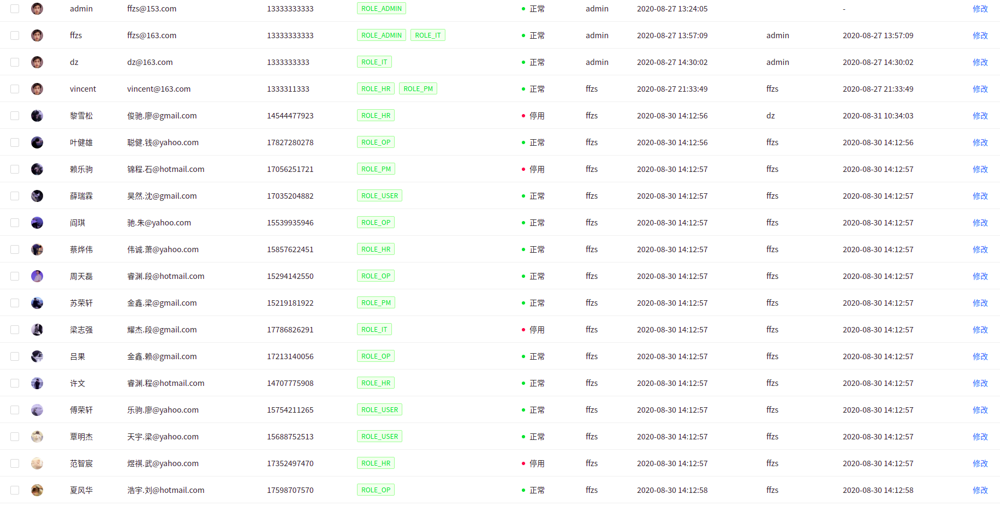
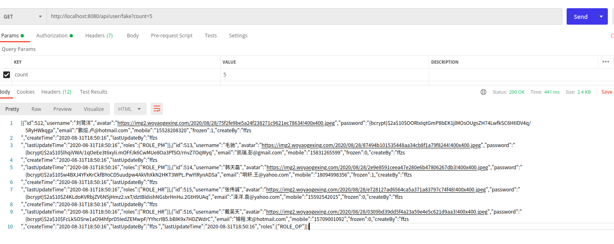

# Spring WebFlux + React搭建后台管理系统（6）: 使用faker获取测试数据


由于测试没有数据，一个一个写的话太麻烦了，这是我们可以使用faker伪造测试数据，之前用写爬虫的时候经常用来生成user-agent，查了一些java也有类似的库：

```java
implementation 'com.github.javafaker:javafaker:0.17.2'
```

+ 通过爬虫获取图像地址
+ 通过faker编写生成SysUser类的对象
+ 通过编写一个faker数据的controller，get传入个数fake相应的用户数据



## 1. 获取头像地址

+ 随便找了个头像网站，编写了一个爬虫获取了一些头像地址
+ 这些网站的结构比较简单
+ 获取数据存入文件中，或是redis数据库啥的都行，为了简单就存在文件了，方便保存（上传github）

```python
import time

import requests
from bs4 import BeautifulSoup
from faker import Faker

f = Faker("zh-CN")

def get_headers():
    return {
        'user-agent': f.user_agent(),
    }

def get_img(url):
    response = requests.get(url, headers=get_headers()).text
    soup = BeautifulSoup(response, 'lxml')
    all_img = soup.find('ul', class_='artCont cl').find_all('img')
    all_src = ['https:'+img.get('src') for img in all_img]
    for item in all_src:
        avatar_file.writelines(item+'\n')
    avatar_file.flush()

def get_page(url):
    response = requests.get(url, headers=get_headers()).text
    soup = BeautifulSoup(response, 'lxml')
    all_txt = soup.find('div', class_='pMain').find_all('a', class_='img')
    all_page = ['https://www.woyaogexing.com'+txt.get('href') for txt in all_txt]
    for page in all_page:
        get_img(page)
        time.sleep(3)

if __name__ == '__main__':
    url = 'https://www.woyaogexing.com/touxiang'
    avatar_file = open("avatar.txt", 'a+', encoding='utf-8')
    get_page(url)
    avatar_file.close()
```

## 2. 编写用户生成服务

+ 读取文件获取头像信息
+ 使用faker生成用户名，手机号，邮箱等数据
+ 密码统一给一个就行不影响
+ 权限随机给
+ 账户不可用，小概率

```java
/**
 * @author: ffzs
 * @Date: 2020/8/30 下午12:53
 */
@Service
@AllArgsConstructor
@Slf4j
public class UserDataFaker {

    private final SysUserService sysUserService;
    private final SysUserRepository sysUserRepository;
    private final Faker f = new Faker(Locale.CHINA);
    private final String[] roles = { "it", "op", "hr", "user", "pm"};

    private SysUser fakeUser (String avatar) {
        return SysUser.builder()
                .avatar(avatar)
                .username(f.name().fullName())
                .password("123zxc")
                .email(f.internet().emailAddress())
                .mobile(f.phoneNumber().cellPhone())
                .frozen(f.random().nextInt(1,10) < 9? 0:1)
                .roles(List.of("ROLE_" + roles[f.random().nextInt(0,roles.length-1)].toUpperCase()))
                .build();
    }


    public Flux<SysUser> fakeUserData (Long count) throws IOException {

        return Flux.fromStream(Files.lines(Paths.get("avatar.txt")))
                .take(count)
                .map(this::fakeUser)
                .flatMap(user -> sysUserRepository
                        .existsByUsername(user.getUsername())
                        .filter(it->it)
                        .then(Mono.just(user)))
                .flatMap(sysUserService::save)
                .onErrorResume(e -> {
                            log.error("{}, {}", e.getClass(), e.getMessage());
                            return Mono.empty();
                });
    }
}
```

## 3.编写接口

+ 通过传入fake的数量进行生成数据
+ 头像地址可以重复使用

```java
@GetMapping("fake")
Flux<SysUser> fake (@RequestParam("count") Long count) throws IOException {
    return userDataFaker.fakeUserData(count);
}
```

## 4. 测试




## 5.代码

| github | [前端（antd pro）](https://github.com/ffzs/System_app_antdpro_fore-end) | [后端（spring webflux）](https://github.com/ffzs/System_app_webflux_react) |
| ------ | ------------------------------------------------------------ | ------------------------------------------------------------ |
| gitee  | [前端（antd pro）](https://gitee.com/ffzs/System_app_antdpro_fore-end) | [后端（spring webflux）](https://gitee.com/ffzs/System_app_webflux_react) |