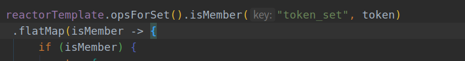
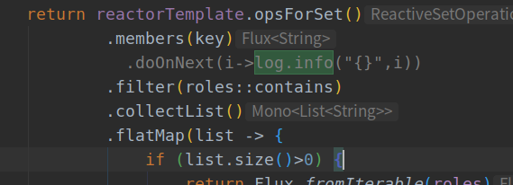
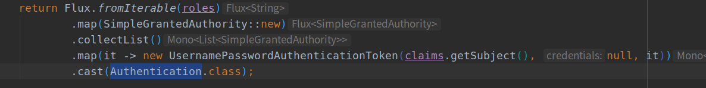
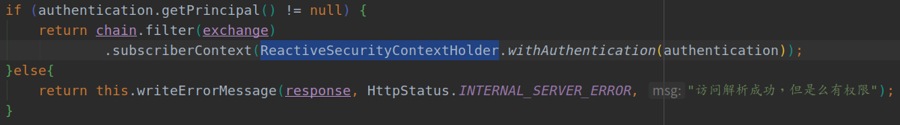
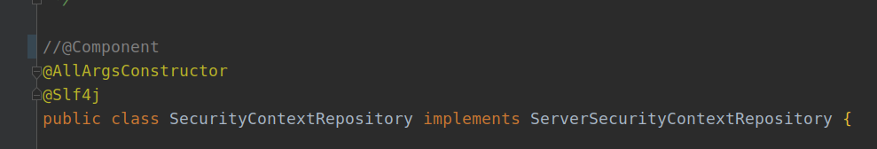
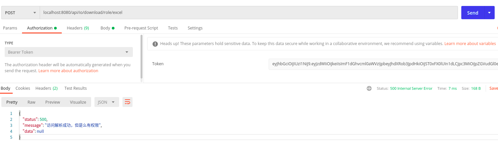

# Spring WebFlux + React搭建后台管理系统（10）:配合Redis进行鉴权

如果是网关等服务，可以将路由及每个路由的权限缓存到redis数据库中，用户访问，在网关进行鉴权：

+ token比对redis缓存的token，不存在返回
+ token进行jwt解析，获取roles
+ 通过api的path和访问模式在redis数据库中获取该接口通行的roles
+ token中的roles和api对应的roles有相交说明有权限，否则返回
+ roles同时通过`ReactiveSecurityContextHolder`进行设置


## 1. 启动时api信息写入redis

+ 通过`PostConstruct`在启动时将数据库中的数据转存到redis中
+ key通过`api_path_method`的方式存储：`String key = "api_" + api.getUrl().trim() + "_" + api.getRemark();`

```java
/**
 * @author: ffzs
 * @Date: 2020/9/1 下午12:52
 */

@Component
@AllArgsConstructor
@Slf4j
@Order(1)
public class prepareRedisData {

    private final ReactiveRedisTemplate<String, String> redisTemplate;
    private final SysApiService sysApiService;

    @PostConstruct
    public void route2Redis() {

        sysApiService.findAll()
                .flatMap(api -> {
                    String key = "api_" + api.getUrl().trim() + "_" + api.getRemark();
                    redisTemplate.delete(key);
                    if (!api.getRoles().isEmpty())
                        return redisTemplate.opsForSet()
                                .add(key, api.getRoles().toArray(new String[0]));
                    else return Mono.empty();
                })
                .subscribe();

        log.info("routes import to redis completed");
    }
}
```

## 2.修改WebFilter进行鉴权

+ 检查token是否存在



+ 检查token是否符合要求
+ 获取redis中的roles进行比对如果用户roles在redis中的数量大于等于1符合要求



+ 根据token获得`Authentication`



+ `Authentication`写入`ReactiveSecurityContextHolder`



### 2.1 完整代码如下

```java
/**
 * @author: ffzs
 * @Date: 2020/8/17 下午12:53
 */

@Component
@Slf4j
@AllArgsConstructor
public class JwtWebFilter implements WebFilter {

    private final JwtSigner jwtSigner;
    private final ReactiveRedisTemplate<String, String> reactorTemplate;

    protected Mono<Void> writeErrorMessage(ServerHttpResponse response, HttpStatus status, String msg) {
        response.getHeaders().setContentType(MediaType.APPLICATION_JSON);
        response.setStatusCode(status);
        ObjectMapper mapper = new ObjectMapper();
        String body;
        try {
            body = mapper.writeValueAsString(new SysHttpResponse(status.value(), msg, null));
        } catch (JsonProcessingException e) {
            return Mono.error(e);
        }
        DataBuffer dataBuffer = response.bufferFactory().wrap(body.getBytes(StandardCharsets.UTF_8));
        return response.writeWith(Mono.just(dataBuffer));
    }


    /**
     * 解析token
     * 判断权限是否在数据库
     *
     * @return
     */
    private Mono<Authentication> checkToken(String token, String key) {
        Claims claims = jwtSigner.parseToken(token);
        Set<String> roles = Stream.of(claims.get(jwtSigner.getAuthoritiesTag()))
                .peek(info -> log.info("roles {}", info))
                .map(it -> (List<Map<String, String>>) it)
                .flatMap(it -> it
                        .stream()
                        .map(i -> i.get("authority"))
                )
                .collect(Collectors.toSet());

        return reactorTemplate.opsForSet()
                .members(key)
//                .doOnNext(i->log.info("{}",i))
                .filter(roles::contains)
                .collectList()
                .flatMap(list -> {
                    if (list.size()>0) {
                        return Flux.fromIterable(roles)
                                .map(SimpleGrantedAuthority::new)
                                .collectList()
                                .map(it -> new UsernamePasswordAuthenticationToken(claims.getSubject(), null, it))
                                .cast(Authentication.class);
                    }
                    else return Mono.just(new UsernamePasswordAuthenticationToken(null, null));
                });
    }

    @SneakyThrows
    @Override
    public Mono<Void> filter(ServerWebExchange exchange, WebFilterChain chain) {
        ServerHttpRequest request = exchange.getRequest();
        if (request.getMethod() == HttpMethod.OPTIONS) return chain.filter(exchange);
        String path = request.getPath().value();
        Set<String> permitPath = new HashSet<>(List.of("/api/auth/login", "/api/auth/logout"));
        if (permitPath.contains(path)) return chain.filter(exchange);
        ServerHttpResponse response = exchange.getResponse();
        String auth = request.getHeaders().getFirst(HttpHeaders.AUTHORIZATION);
        if (auth == null) {
            return this.writeErrorMessage(response, HttpStatus.NOT_ACCEPTABLE, "没有携带token");
        } else if (!auth.startsWith(jwtSigner.getTokenPrefix())) {
            return this.writeErrorMessage(response, HttpStatus.NOT_ACCEPTABLE, "token 没有以" + jwtSigner.getTokenPrefix() + "开始");
        }

        String token = auth.substring(jwtSigner.getTokenPrefix().length());
        String key = "api_"+path+"_"+request.getMethodValue().toLowerCase();


        return reactorTemplate.opsForSet().isMember("token_set", token)
                .flatMap(isMember -> {
                    if (isMember) {
                        try {
//                            exchange.getAttributes().put("token", token);
                            return checkToken(token, key)
                                    .flatMap(authentication -> {
                                        if (authentication.getPrincipal() != null) {
                                            return chain.filter(exchange)
                                                    .subscriberContext(ReactiveSecurityContextHolder.withAuthentication(authentication));
                                        }else{
                                            return this.writeErrorMessage(response, HttpStatus.INTERNAL_SERVER_ERROR, "访问解析成功，但是么有权限");
                                        }
                                    });
                        } catch (Exception e) {
                            return this.writeErrorMessage(response, HttpStatus.INTERNAL_SERVER_ERROR, e.getMessage());
                        }
                    } else {
                        return this.writeErrorMessage(response, HttpStatus.UNAUTHORIZED, "非法token，没有发布过该token，或已经删除");
                    }
                });
    }
}
```

## 3.取消AuthenticationManager使用

这时就可以不再使用AuthenticationManager和ServerSecurityContextRepository。

取消`@Component`不再注入




+ 同时取消`ReactiveUserDetailsService`使用


## 4.测试

+ 通过没有权限的用户进行访问结果如下



## 5. 源码

| github | [前端（antd pro）](https://github.com/ffzs/System_app_antdpro_fore-end) | [后端（spring webflux）](https://github.com/ffzs/System_app_webflux_react) |
| ------ | ------------------------------------------------------------ | ------------------------------------------------------------ |
| gitee  | [前端（antd pro）](https://gitee.com/ffzs/System_app_antdpro_fore-end) | [后端（spring webflux）](https://gitee.com/ffzs/System_app_webflux_react) |

