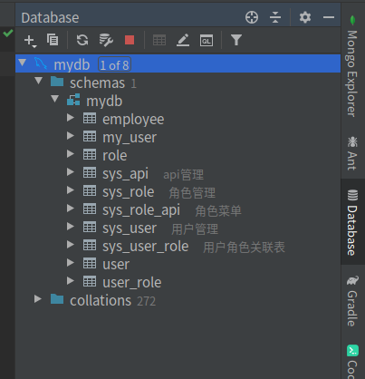
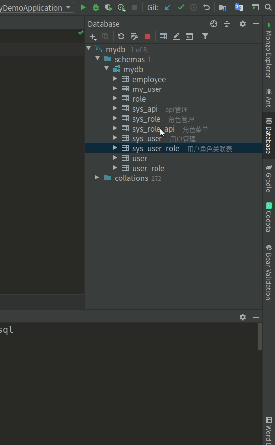
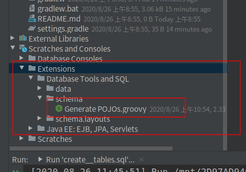
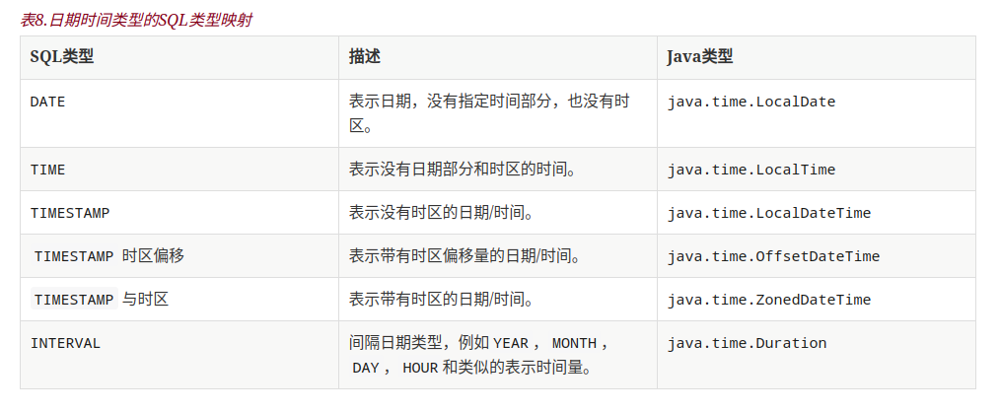
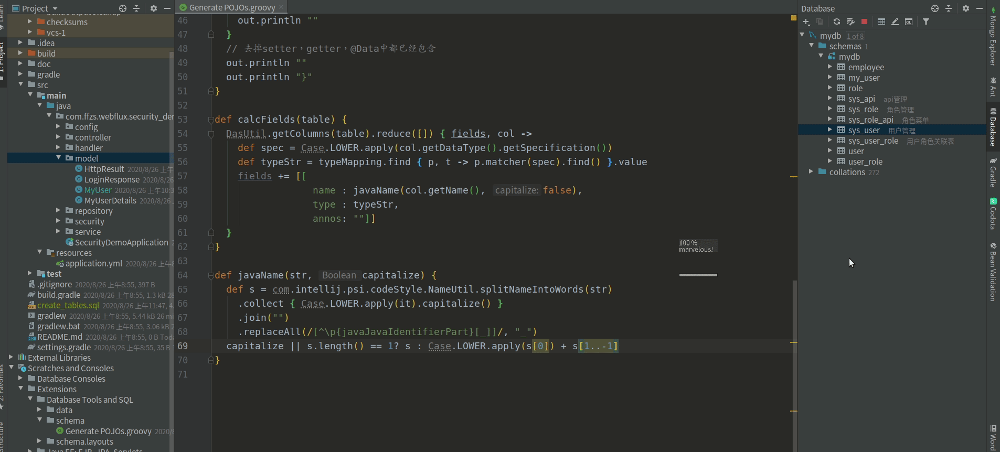

# Spring WebFlux + React搭建后台管理系统（1）:创建数据表及生成POJOs

搞了一个月的响应式，开个新坑，本系列简单搭建一个后台管理系统，主要功能如下：

+ jwt 登录+鉴权
+ 实现用户管理页面，用户查询数据表，增删改表单
+ 实现api管理页面，api权限管理的增添修改
+ mysql存储用户信息
+ redis用于缓存权限路由映射，记录token

使用技术栈：

后端使用spring webflux + mysql + redis + jwt实现 RESTful api + RSocket？，前端使用reactjs + umijs + antd + material-ui？。

+ springboot：2.3.2.RELEASE
+ mysql：8
+ redis：6
+ umijs：v3
+ antd：4
+ Idea：2019.3
+ gradle：6.4.1

## 创建数据表

实现功能需要创建如下几个表：

| table名称     | 功能描述                        |
| ------------- | ------------------------------- |
| sys_user      | 用于存储管理用户信息            |
| sys_role      | 用于存储管理权限角色            |
| sys_user_role | 用于关联用户的权限角色情况      |
| sys_api       | 用于管理后台api的路由信息       |
| sys_role_api  | 用于关联权限角色可以访问哪些api |

下面是完整的sql代码：

```sql
CREATE DATABASE IF NOT EXISTS mydb;
USE mydb;
-- ----------------------------
--  Table structure for `sys_user`
-- ----------------------------

DROP TABLE IF EXISTS `sys_user`;
CREATE TABLE `sys_user`
(
    `id`               bigint      NOT NULL AUTO_INCREMENT COMMENT '编号',
    `username`         varchar(50) NOT NULL COMMENT '用户名',
    `avatar`           varchar(255)         DEFAULT NULL COMMENT '头像地址',
    `password`         varchar(100)         DEFAULT NULL COMMENT '密码',
    `email`            varchar(100)         DEFAULT NULL COMMENT '邮箱',
    `mobile`           varchar(100)         DEFAULT NULL COMMENT '手机号',
    `frozen`           tinyint(4)           DEFAULT '0' COMMENT '账号是否被冻结使用，0：正常， 1：冻结',
    `create_by`        varchar(50)          DEFAULT NULL COMMENT '创建人',
    `create_time`      datetime             DEFAULT NULL COMMENT '创建时间',
    `last_update_by`   varchar(50)          DEFAULT NULL COMMENT '更新人',
    `last_update_time` datetime             DEFAULT NULL COMMENT '更新时间',
    PRIMARY KEY (`id`),
    UNIQUE KEY `user_username` (`username`),
    UNIQUE INDEX `user_email` (`email`)
) ENGINE = InnoDB DEFAULT CHARSET = utf8 COMMENT ='用户管理';

-- ----------------------------
--  Table structure for `sys_user_role`
-- ----------------------------

DROP TABLE IF EXISTS `sys_role`;
CREATE TABLE `sys_role`
(
    `id`               bigint NOT NULL AUTO_INCREMENT COMMENT '编号',
    `name`             varchar(100) DEFAULT NULL COMMENT '角色名称',
    `remark`           varchar(100) DEFAULT NULL COMMENT '备注',
    `create_by`        varchar(50)  DEFAULT NULL COMMENT '创建人',
    `create_time`      datetime     DEFAULT NULL COMMENT '创建时间',
    `last_update_by`   varchar(50)  DEFAULT NULL COMMENT '更新人',
    `last_update_time` datetime     DEFAULT NULL COMMENT '更新时间',
    PRIMARY KEY (`id`)
) ENGINE = InnoDB
  DEFAULT CHARSET = utf8 COMMENT ='角色管理';

-- ----------------------------
--  Table structure for `sys_user_role`
-- ----------------------------

DROP TABLE IF EXISTS `sys_user_role`;
CREATE TABLE `sys_user_role`
(
    `id`               bigint NOT NULL AUTO_INCREMENT COMMENT '编号',
    `user_id`          bigint  DEFAULT NULL COMMENT '用户ID',
    `role_id`          bigint  DEFAULT NULL COMMENT '角色ID',
    `create_by`        varchar(50) DEFAULT NULL COMMENT '创建人',
    `create_time`      datetime    DEFAULT NULL COMMENT '创建时间',
    `last_update_by`   varchar(50) DEFAULT NULL COMMENT '更新人',
    `last_update_time` datetime    DEFAULT NULL COMMENT '更新时间',
    PRIMARY KEY (`id`)
) ENGINE = InnoDB
  DEFAULT CHARSET = utf8 COMMENT ='用户角色关联表';


-- ----------------------------
--  Table structure for `sys_api`
-- ----------------------------

DROP TABLE IF EXISTS `sys_api`;
CREATE TABLE `sys_api`
(
    `id`               bigint(20) NOT NULL AUTO_INCREMENT COMMENT '编号',
    `name`             varchar(50)  DEFAULT NULL COMMENT 'api名称',
    `url`              varchar(200) DEFAULT NULL COMMENT 'api的route',
    `remark`           varchar(200) DEFAULT NULL COMMENT '备注：标注api用途',
    `create_by`        varchar(50)  DEFAULT NULL COMMENT '创建人',
    `create_time`      datetime     DEFAULT NULL COMMENT '创建时间',
    `last_update_by`   varchar(50)  DEFAULT NULL COMMENT '更新人',
    `last_update_time` datetime     DEFAULT NULL COMMENT '更新时间',
    PRIMARY KEY (`id`)
) ENGINE = InnoDB
  DEFAULT CHARSET = utf8 COMMENT ='api管理';

-- ----------------------------
--  Table structure for `sys_role_api`
-- ----------------------------

DROP TABLE IF EXISTS `sys_role_api`;
CREATE TABLE `sys_role_api`
(
    `id`               bigint  NOT NULL AUTO_INCREMENT COMMENT '编号',
    `role_id`          bigint  DEFAULT NULL COMMENT '角色ID',
    `api_id`           bigint  DEFAULT NULL COMMENT 'API ID',
    `create_by`        varchar(50) DEFAULT NULL COMMENT '创建人',
    `create_time`      datetime    DEFAULT NULL COMMENT '创建时间',
    `last_update_by`   varchar(50) DEFAULT NULL COMMENT '更新人',
    `last_update_time` datetime    DEFAULT NULL COMMENT '更新时间',
    PRIMARY KEY (`id`),
    INDEX role_id (`role_id`)
) ENGINE = InnoDB
  DEFAULT CHARSET = utf8 COMMENT ='api角色映射';
```

可以使用mysql执行sql文件，也可以通过idea连接mysql之后执行，完成数据表的创建。

## models生成

### 1. 创建spring项目

为了方便在之前写的[Spring WebFlux (9): 配合redis使用](https://blog.csdn.net/tonydz0523/article/details/108129769)基础之上完成，省区一些配置和逻辑的编写：

```bash
git clone https://github.com/ffzs/webflux_jwt_redis.git
```

### 2. idea连接mysql

使用idea的database链接到mysql对应的数据库



### 3. 修改表转换POJOs 脚本文件

按照下图所示找到转换POJO脚本的文件夹：



在文件夹中找到对应的POJOs的脚本：



修改该脚本，使其适用于lombok：
+ r2dbc中时间和jpa中使用的类型不同



+ 一些`jpa`的功能不能使用，如`EntityListeners`，因此`createBy`这些都要自己实现

```groovy
import com.intellij.database.model.DasTable
import com.intellij.database.util.Case
import com.intellij.database.util.DasUtil

/* 适用 lombok
 */

packageName = "com.ffzs.webflux.security_demo.model;"   // 这里修改为你自己的package
typeMapping = [
        (~/(?i)int/)                      : "long",
        (~/(?i)float|double|decimal|real/): "double",
        (~/(?i)datetime|timestamp/)       : "java.time.LocalDateTime", // r2dbc中datetime对应的事LocalDateTime
        (~/(?i)date/)                     : "java.time.LocalDate",  // r2dbc对应
        (~/(?i)time/)                     : "java.time.LocalTime",  // r2dbc对应
        (~/(?i)/)                         : "String"
]

FILES.chooseDirectoryAndSave("Choose directory", "Choose where to store generated files") { dir ->
    SELECTION.filter { it instanceof DasTable }.each { generate(it, dir) }
}

def generate(table, dir) {
    def className = javaName(table.getName(), true)
    def fields = calcFields(table)
    new File(dir, className + ".java").withPrintWriter { out -> generate(out, className, fields, table.getName()) }
}

def generate(out, className, fields, tableName) {
    out.println "package $packageName"
    out.println ""
    out.println "import lombok.*;"    // 添加import
    out.println "import org.springframework.data.annotation.*;"
    out.println "import org.springframework.data.relational.core.mapping.Table;"
    out.println ""
    out.println ""
    out.println "@Table(\"$tableName\")"    // 添加lombok相关注释
    out.println "@Data"
    out.println "@AllArgsConstructor"
    out.println "@NoArgsConstructor"
    out.println "public class $className {"
    out.println ""
    fields.each() {
        if (it.annos != "") out.println "    ${it.annos}"
        if (it.name == "id") out.println "    @Id"
        // 因为r2dbc还没有整合自动更新的功能
//        if (it.name == "createBy") out.println "    @CreatedBy"
//        if (it.name == "createTime") out.println "    @CreatedDate"
//        if (it.name == "lastUpdateBy") out.println "    @LastModifiedBy"
//        if (it.name == "lastUpdateTime") out.println "    @LastModifiedDate"
        out.println "    private ${it.type} ${it.name};"
        out.println ""
    }
    // 去掉setter，getter，@Data中都已经包含
    out.println ""
    out.println "}"
}

def calcFields(table) {
    DasUtil.getColumns(table).reduce([]) { fields, col ->
        def spec = Case.LOWER.apply(col.getDataType().getSpecification())
        def typeStr = typeMapping.find { p, t -> p.matcher(spec).find() }.value
        fields += [[
                           name : javaName(col.getName(), false),
                           type : typeStr,
                           annos: ""]]
    }
}

def javaName(str, capitalize) {
    def s = com.intellij.psi.codeStyle.NameUtil.splitNameIntoWords(str)
            .collect { Case.LOWER.apply(it).capitalize() }
            .join("")
            .replaceAll(/[^\p{javaJavaIdentifierPart}[_]]/, "_")
    capitalize || s.length() == 1? s : Case.LOWER.apply(s[0]) + s[1..-1]
}

```

### 4. 转换POJOs

在idea中的database中适用之前编写的脚本生成POJO,这里使用sys_user表举个例子：



其他变同样方法操作即可。