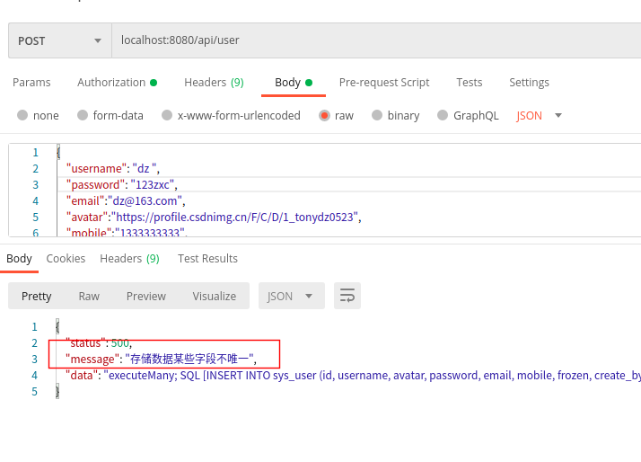
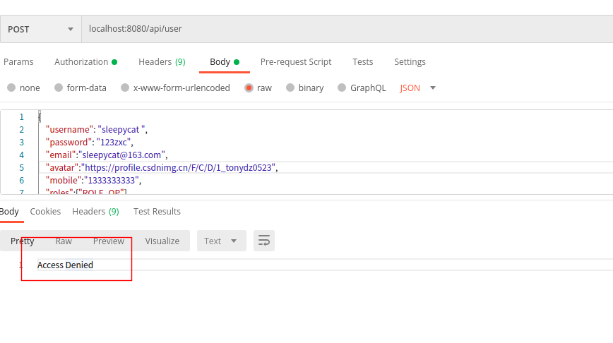
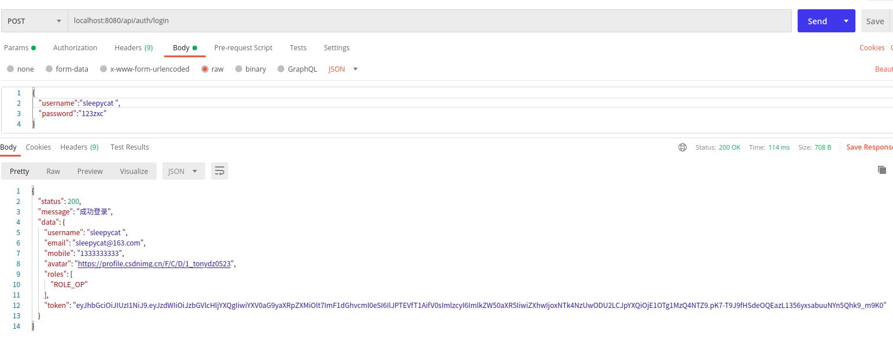
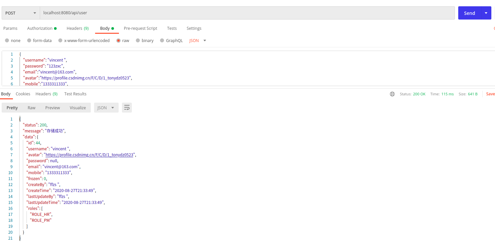
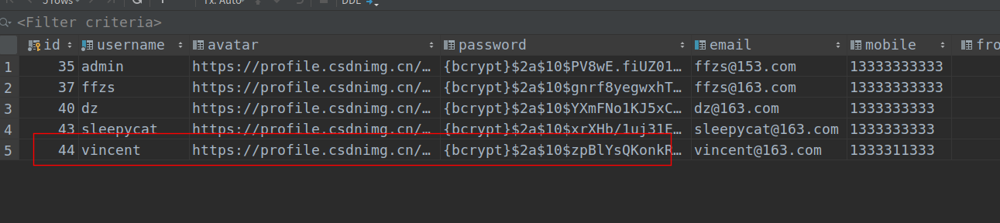

# Spring WebFlux + React搭建后台管理系统（2）: 主要业务逻辑实现


上一篇简单实现了数据库表的生成以及生成POJO,这里主要介绍后台服务中实现的接口以及如何通过使用webflux实现一些复杂的逻辑,以及登录鉴权等内容。


## 业务接口

如下为整理的实现的借口汇总，应为是RESTful接口，一个path会对应多个功能：

| Url                    | HttpMethod | 描述                   |
| ---------------------- | ---------- | ---------------------- |
| /api/auth/logout  | get        | 登出                   |
| /api/auth/login   | post       | 登入                   |
| /api/user         | get        | 通过用户名获取数据用户 |
| /api/user         | post       | 存储用户               |
| /api/user         | put        | 更新用户数据           |
| /api/user         | delete     | 通过id删除用户         |
| /api/user/all     | get        | 获取全部用户数据       |
| /api/role         | get        | 通过权限名称获取       |
| /api/role         | post       | 存储权限               |
| /api/role         | put        | 更新权限               |
| /api/role         | delete     | 通过id删除权限         |
| /api/role/all     | get        | 获取所有权限数据       |
| /api/url          | get        | 通过url获取接口信息    |
| /api/url          | post       | 存储接口信息           |
| /api/url          | put        | 更新接口信息           |
| /api/url          | delete     | 通过id删除接口信息     |
| /api/url/all      | get        | 获取所有接口信息       |


## 实现业务逻辑

简单通过user局里，api和user的逻辑基本相同，role更简单一些

### 1 . 生成Pojo

具体过程上一篇已经讲过了，通过使用idea可以很简单的生成，不过reactive的models和jpa的有些差别，有些点需要注意：

+ 不能使用jpa中`EntityListeners`自动生成更新人更新日期等，需要自己写
+ mysql中datetime类型对应的类型为`LocalDateTime`，这也是不同之处
+ 不存在与数据库中的字段使用@Transient进行注释
+ 请求返回json不希望显示的字段使用`@JsonIgnore`
+ 添加`roles`字段用于存放权限信息
+ 因为几个对象都有createBy等属性，通过编写DataChange接口通过泛型添加

```java
@Table("sys_user")
@Data
@AllArgsConstructor
@NoArgsConstructor
@With
public class SysUser implements DataChange {

    @Id
    private long id;

    private String username;

    private String avatar;

    //@JsonIgnore   // 请求返回json不希望显示的字段
    private String password;

    private String email;

    private String mobile;

    private long frozen;

    private String createBy;

    private java.time.LocalDateTime createTime;

    private String lastUpdateBy;

    private java.time.LocalDateTime lastUpdateTime;

    @Transient   // 不存在与数据库中的字段
    private List<String> roles;

}
```

### 2. 编写Repository

+ 继承`ReactiveCrudRepository`使用
+ 使用方法和jpa类似
+ 注意返回类型，Mono或者Flux，返回单个用Mono，多个Collection类型的用Flux
+ 基本的crud方法`ReactiveCrudRepository`中都有

```java
/
 * @author: ffzs
 * @Date: 2020/8/26 下午12:51
 */
public interface SysUserRepository extends ReactiveCrudRepository<SysUser, Long> {
    Mono<SysUser> findByUsername(String username);
}
```

### 3. 编写DataChange接口文件

+ 为了更方便使用泛型对几种对象实现设置属性

```java
/
 * @author: ffzs
 * @Date: 2020/8/26 下午11:21
 */

public interface DataChange {

    void setCreateBy(String createBy);

    void setCreateTime(LocalDateTime createTime);

    void setLastUpdateBy(String lastUpdateBy);

    void setLastUpdateTime(LocalDateTime lastUpdateTime);
}
```

### 4. 编写为对象添加修改时间等属性服务

+ 由于r2dbc不支持自动更新修改时间，修改人的功能
+ 编写如下方法自行进行修改

```java
/
 * @author: ffzs
 * @Date: 2020/8/27 下午1:51
 */
@Service
public class MarkDataService {

    public <T extends DataChange> Mono<T> createObj (T obj) {
        return ReactiveSecurityContextHolder.getContext()
                .map(it->it.getAuthentication().getPrincipal())
                .map(it -> {
                    LocalDateTime now = java.time.LocalDateTime.now();
                    obj.setCreateBy((String)it);
                    obj.setCreateTime(now);
                    obj.setLastUpdateBy((String)it);
                    obj.setLastUpdateTime(java.time.LocalDateTime.now());
                    return obj;
                });
    }

    public <T extends DataChange> Mono<T> updateObj (T obj) {
        return ReactiveSecurityContextHolder.getContext()
                .map(it->it.getAuthentication().getPrincipal())
                .map(it -> {
                    obj.setLastUpdateBy((String)it);
                    obj.setLastUpdateTime(java.time.LocalDateTime.now());
                    return obj;
                });
    }
}
```

### 5. 实现user服务层

由于返回基本都是Mono，Flux，webflux的服务层写法跟之前差的还挺多，有几个逻辑需要处理：

+ `r2dbc`不能实现多对多，一对多的关联字段，因此获取权限的逻辑需要自己写
+ 下面是在user中获取roles的方法

```java
private Mono<SysUser> addRoles (SysUser user) {

    return sysUserRoleRepository
            .findByUserId(user.getId())
            .map(SysUserRole::getRoleId)
            .flatMap(sysRoleRepository::findById)
            .map(SysRole::getName)
            .collectList()
            .map(it -> {
                user.setRoles(it);
                return user;
            });
}
```

+ 查找结果是在得到的user基础上加上roles

```java
public Mono<SysUser> findByUsername (String username) {
    return sysUserRepository.findByUsername(username)
            .flatMap(this::addRoles);
}
```

+ 在添加数据的时候需要将roles的信息分别添加到`sys_role`和`sys_user_role`表中
+ `sys_role`没有的role需要添加进去。下面代码完成这一工作：

```java
private Mono<SysUser> saveRoles (SysUser user) {
    List<String> roles = user.getRoles();
    if (roles==null || roles.isEmpty()) return Mono.just(user);
    return Flux.fromIterable(roles)
            .flatMap(role -> sysRoleRepository.findByName(role)
                    .switchIfEmpty(
                            mark.createObj(new SysRole(role))
                                    .flatMap(sysRoleRepository::save)
                                    .map(SysRole::getName)
                                    .flatMap(sysRoleRepository::findByName)
                    )
                    .map(SysRole::getId)

            )
            .flatMap(roleId -> sysUserRoleRepository
                    .findByUserIdAndRoleId(user.getId(), roleId)
                    .switchIfEmpty(mark.createObj(new SysUserRole(user.getId(), roleId))
                            .cast(SysUserRole.class)
                            .flatMap(sysUserRoleRepository::save)
                    )
                    .map(SysUserRole::getId))
            .collectList()
            .then(Mono.just(user));
}
```

+ 使用一个save方法处理添加新数据和更新数据
+ 通过id来区别是跟新还是添加，更新的话id不会是0
+ 更新的时候需要注意创建人和创建时间不要被覆盖

```java
public Mono<SysUser> save (SysUser user) {
    user.setPassword(password.encode(user.getPassword()));

    if (user.getId() != 0) {  // id不为0为更新update
        return mark.updateObj(user)
                .flatMap(it -> sysUserRepository
                        .findByUsername(user.getUsername())
                        .map(oldUser -> it
                                .withCreateBy(oldUser.getCreateBy())
                                .withCreateTime(oldUser.getCreateTime())
                        ))
                .flatMap(sysUserRepository::save)
                .flatMap(this::saveRoles);
    }
    else {   // id为0为create
        return mark.createObj(user)
                .flatMap(sysUserRepository::save)
                .map(SysUser::getUsername)
                .flatMap(sysUserRepository::findByUsername)
                .map(it -> it.withRoles(user.getRoles()))
                .flatMap(this::saveRoles);
    }
}
```

+ 删除的时候，需要将user带的roles一起删掉

```java
public Mono<Void> deleteById (Long id) {
    return sysUserRepository.deleteById(id)
            .flatMap(it -> sysUserRoleRepository.deleteByUserId(id));
}
```

### 5. 实现User的控制层

控制层就是简单的api，实现了简单的功能：

+ 通过`SysHttpResponse`统一包装回复
+ 出现的错误可以通过错误类型给出相应恢复
+ 对于更改数据删除数据给`ADMIN`等权限限制

```java
@PostMapping
@PreAuthorize("hasAnyRole('ADMIN', 'IT')")
Mono<SysHttpResponse> save (@RequestBody SysUser user) {
    return sysUserService.save(user)
            .map(it->SysHttpResponse
                    .builder()
                    .status(HttpStatus.OK.value())
                    .message("存储成功")
                    .data(it)
                    .build()
            )
            .onErrorResume(err -> {
                SysHttpResponse response = new SysHttpResponse(HttpStatus.INTERNAL_SERVER_ERROR.value(), "运行出错", err.getMessage());
                if (err instanceof DataIntegrityViolationException) {
                    response = new SysHttpResponse(HttpStatus.INTERNAL_SERVER_ERROR.value(), "存储数据某些字段不唯一", err.getMessage());
                }
                return Mono.just(response);
            });
}
```

+ 因为姓名重复导致的报错可以得到相应的回复



+ 由于权限导致不能访问



### 6. 登录控制层实现

实现方法和[Spring WebFlux (7): Springboot Security+jwt登录鉴权](https://blog.csdn.net/tonydz0523/article/details/108065025)写的差不多，这里添加了logout，用来删除redis中的token

```java
@GetMapping("logout")
public Mono<SysHttpResponse> logout (@RequestParam("token") String token) {
    return Mono.just(token)
            .flatMap(redisService::deleteToken)
            .flatMap(it -> Mono.just(SysHttpResponse.ok(it)))
            .onErrorResume(e -> Mono.just(SysHttpResponse.error5xx("删除token出错", e.getMessage())))
            .switchIfEmpty(Mono.just(SysHttpResponse.error5xx("删除token出错", null)));
}
```

## 简单测试

+ 登录



+ 插入数据





不过多展示了，代码在下面，可以自己尝试一下。。


## 代码：

[github](https://github.com/ffzs/System_app_webflux_react)
[gitee](https://gitee.com/ffzs/System_app_webflux_react)

