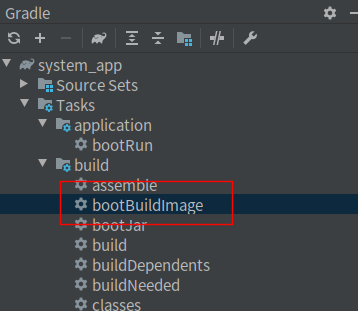
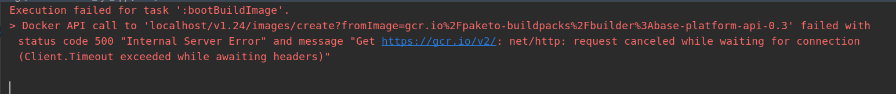
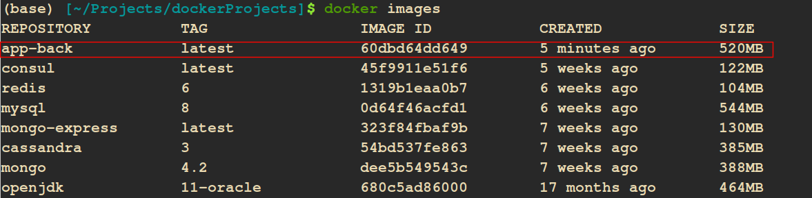
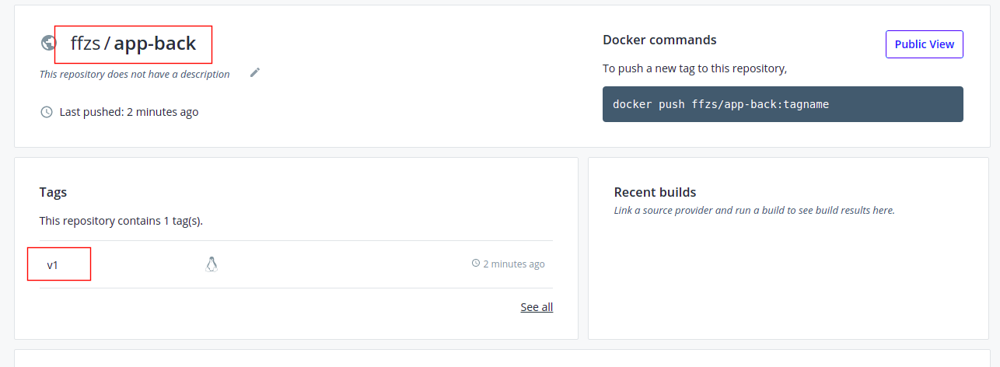
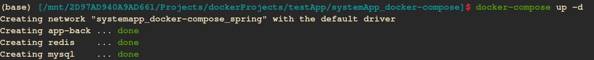
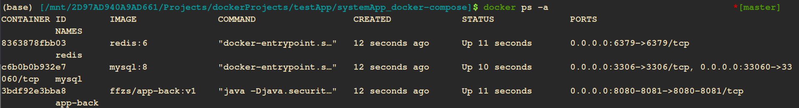

# Spring WebFlux + React搭建后台管理系统（13）:微服务 项目制作成docker image


## 1.微服务

现在是微服务(Microservices )大行其道的时代，微服务将一个大的服务拆分成多个独立的服务，通过网络在独立的服务之间进行沟通，这样做可以使各个独立服务之间松耦合，就像变形金刚每个是独立的，但是可以合体成为一个超级战士。

微服务的优点还是很多的：

+ 每个服务模块之间低耦合，开发人员可以专心完成自己的任务
+ 微服务能使用不同的语言开发。不同的服务通过注册中心整合
+ 可以提高容错性能，通过熔断器处理，如果问题直接熔断，不会导致雪崩效应
+ 每个服务可以通过需求配置到合适硬件的服务器上，深度学习的服务需要gpu
+ 通过docker进行封装成独立的image，可以自由插拔
+ 通过k8s可以自由调整每种服务使用数量：如果一个服务访问激增，可以通过k8s添加服务容器进行扩展，减轻负担，等闲时在将多余的去掉即可
+ 通过网关统一管理访问
+ 服务之间通信多种选择：HTTP ，RPC， RSocket，消息队列（kafka）
+ 通过使用k8s进行灰度发布，时跟新功能更平滑
+ 可以优先完成核心服务，其他服务可以后续组装上

缺点：

+ 项目需要前后端分离，对于一些程序员需要更新技术
+ 每个服务小团队以做产品的方式负责整个生命周期，不需要交付给测试，前后端、不同服务之间关联不大，不好扯皮推卸责任
+ 分布式系统有一定的复杂性，管理起来困难，不过现在有k8s，链路
+ 服务之间通信耗时影响用户体验，rpc, rsocket 等一些新技术可以降低传输耗时，响应式也可以减少耗时

## 2. 制作image

`springboot`自2.3.0版本之后自带生成image工具，通过mvn或是gradle可以通过命令直接生成：




但是运行报错，可能是网址不能访问吧，哪位老哥知道是啥原因还请评论告知：



先进的用不上，只能上土方法了：

+ build生成jar包
+ 使用Dockerfile创建

### 2.1 Dockerfile创建

+ 需要将jar包和初始数据以及生成表的sql文件放入容器
+ 配置启动的命令，设置时间

```dockerfile
FROM openjdk:11-oracle
VOLUME /tmp
COPY build/libs/system_app-1.0.0-SNAPSHOT.jar app.jar
COPY Data Data/
COPY create_tables.sql .
ENTRYPOINT ["java","-Djava.security.egd=file:/dev/./urandom","-Duser.timezone=Asiz/Shanghai","-Dfile.encoding=UTF-8","-jar","/app.jar"]
```

### 2.2 创建images

+ 我将这个images命名为app-back

```bash
docker build -t app-back .     
```



## 3. images上传dockerhub

上传方法可以参考之前文章：

[搞机：本地 docker 镜像上传到 docker hub](https://blog.csdn.net/tonydz0523/article/details/106686919)

+ 命名空间和版本号



## 4. 编写docker-compose文件

+ 项目依赖mysql，redis
+ 因此需要通过将mysql和redis一并拉下来

```yml
version: '3'
services:
    redis:
        image: redis:6
        container_name: redis
        restart: always
        networks:
            - spring
        ports:
            - 6379:6379
        volumes:
            - ./redis/conf/redis.conf:/usr/local/etc/redis/redis.conf
            - ./redis/db/:/data/           
        command: redis-server /usr/local/etc/redis/redis.conf

    mysql:
        image: mysql:8
        container_name: mysql
        networks:
            - spring
        restart: always
        ports:
            - 33060:33060
            - 3306:3306
        volumes:
            - ./mysql/db:/var/lib/mysql
            - ./mysql/conf.d:/etc/mysql/conf.d
        environment:
            - MYSQL_ROOT_PASSWORD=123zxc    
        command: --default-authentication-plugin=mysql_native_password

    app-back:
        image: ffzs/app-back:v1
        container_name: app-back
        restart: always
        networks:
            - spring
        ports:
            - 8080:8080
            - 8081:8081

networks:
    spring:
```

如果mysql中数据需要持久化到本地的话，需要配置volumes ，在项目目录下面创建文件夹

+ ./redis/db/
+ ./mysql/db
+ ./mysql/conf.d

此外还要配置redis的配置，`./redis/conf/redis.conf`：

+ requirepass 是密码

```bash
requirepass 123zxc

stop-writes-on-bgsave-error no
rdbcompression no
dbfilename dump.rdb

appendonly yes
appendfsync everysec
no-appendfsync-on-rewrite no
auto-aof-rewrite-percentage 100
auto-aof-rewrite-min-size 64mb

dir /data/

```

## 5.使用

+ 把docker-compose项目拉下来

```
git clone https://github.com/ffzs/systemApp_docker-compose.git
```

+ cd 到项目目录

```bash
cd systemApp_docker-compose
```

+ 使用docker-compose执行



+ ps -a 查看运行情况，都正常运行：



