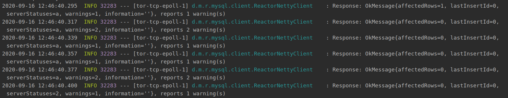

# Spring WebFlux + React搭建后台管理系统（12）:初次运行初始化表格和数据


这里有一个使用场景：我希望通过docker-compose直接部署我的项目，运行的时候拉下来的mysql数据库容器中是空的，而且r2dbc没有初始化数据库这里功能，需要通过sql文件进行配置，这里有两个选项：

+ 通过mysql容器进行配置，这样不好控制，配置起来比较麻烦
+ 通过spring服务端配置，读取sql文件通过jdbc进行配置

这里又有一个问题就是，我们在配置文件中配置的mysql的路径是有数据库的，如果使用注入的DatabaseClient的话是不行的，因为数据库还没有创建，直接使用会提示找不到xx数据库，因此需要在配置sql文件内容的时候自己再创建一个没有数据库的DatabaseClient。

```java
DatabaseClient client = DatabaseClient.create(ConnectionFactories
        .get(builder()
                .option(USER, "root")
                .option(DRIVER, "mysql")
                .option(PASSWORD, "123zxc")
                .option(HOST, "localhost")
                .option(PORT, 3306)
                .build())
);
```

通过读取sql文件中的内容：

```java
String sqlScript = Files.readString(Path.of(sqlScriptPath));
```

通过client对数据库进行操作：

```java
client.execute(sqlScript)
.fetch()
.rowsUpdated()
```

这个时候数据库和数据表有了，我们需要将初始化一些数据，我的初始化数据都导出在excel文件中:

+ 使用`@PostConstruct`在完成启动之前初始化数据
+ 通过读取excel中的数据，然后写入数据库

```java
private Mono<List<SysRole>> initRole () {
    return Mono.fromCallable(()->ReadExcelUtil.readExcel("Data/role_data.xlsx", 0, SysRole.class))
            .flatMap(roleList-> Flux.fromIterable(roleList)
                    .cast(SysRole.class)
                    .map(it -> it.withId(0))
                    .flatMap(sysRoleService::save)
                    .collectList()
            );
}
```

由于，写入数据这个过程必须在数据库创建，以及表创建之后完成，而r2dbc进行数据库操作又是异步的



只要将创建过程和写入数据写在一个过程中进行，并且在创建之后即可：

```java
client.execute(sqlScript)
.fetch()
.rowsUpdated()
.then(initRole())
.then(initUser())
.then(initApi())
```

或者使用主线程等待：

```java
Thread.sleep(2000);
```

这时又有问题了，不能每回启动都初始化数据库写入数据吧，这里两个解决方法：

+ 通过配置文件给一个参数进行判断，但是项目都写到docker中了，更改配置需要使用刷新配置，config等配置，比较麻烦
+ 可以通过判断数据库中是否存在某个表，是否有用户，就知道是否初始化过了

我是通过判断user表中是否存在admin用户，因为我这user表中一定会有这个admin用户，没有就是没有初始化

```java
sysUserService.findByUsername("admin")
        .switchIfEmpty(
                client.execute(sqlScript)
                .fetch()
                .rowsUpdated()
                .then(initRole())
                .then(initUser())
                .then(initApi())
                .then(Mono.empty())
        )
        .block();
```

完整代码：

```java
/**
 * @author: ffzs
 * @Date: 2020/9/16 上午8:02
 */

@Component
@Slf4j
@RequiredArgsConstructor
@Order(0)
public class Create_Database {

    @Value("${my.filesPath.sqlScript}")
    private String sqlScriptPath;

    private final SysUserService sysUserService;
    private final SysRoleService sysRoleService;
    private final SysApiService sysApiService;

    @PostConstruct
    public void createTable () throws IOException, InterruptedException {
        DatabaseClient client = DatabaseClient.create(ConnectionFactories
                .get(builder()
                        .option(USER, "root")
                        .option(DRIVER, "mysql")
                        .option(PASSWORD, "123zxc")
                        .option(HOST, "localhost")
                        .option(PORT, 3306)
                        .build())
        );

        String sqlScript = Files.readString(Path.of(sqlScriptPath));
        sysUserService.findByUsername("admin")
                .switchIfEmpty(
                        client.execute(sqlScript)
                        .fetch()
                        .rowsUpdated()
                        .then(initRole())
                        .then(initUser())
                        .then(initApi())
                        .then(Mono.empty())
                )
                .block();

        Thread.sleep(2000);
        log.info("数据库以及数据初始化完成。。");
    }

    private Mono<List<SysRole>> initRole () {
        return Mono.fromCallable(()->ReadExcelUtil.readExcel("Data/role_data.xlsx", 0, SysRole.class))
                .flatMap(roleList-> Flux.fromIterable(roleList)
                        .cast(SysRole.class)
                        .map(it -> it.withId(0))
                        .flatMap(sysRoleService::save)
                        .collectList()
                );
    }

    private Mono<List<SysUser>> initUser () {
        return Mono.fromCallable(()->ReadExcelUtil.readExcel("Data/user_data.xlsx", 0, SysUser.class))
                .flatMap(userList-> Flux.fromIterable(userList)
                        .cast(SysUser.class)
                        .map(it -> it.withId(0))
                        .map(it -> it.withPassword("123zxc"))
                        .flatMap(sysUserService::insert)
                        .collectList()
                );
    }

    private Mono<List<SysApi>> initApi () {
        return Mono.fromCallable(()->ReadExcelUtil.readExcel("Data/url_data.xlsx", 0, SysApi.class))
                .flatMap(userList-> Flux.fromIterable(userList)
                        .cast(SysApi.class)
                        .map(it -> it.withId(0))
                        .flatMap(sysApiService::save)
                        .collectList()
                );
    }
}
```


tips：

使用`@PostConstruct`初始化数据的话，配置中不要出现这个配置：

```yaml
#  main:
#    lazy-initialization: true
```

